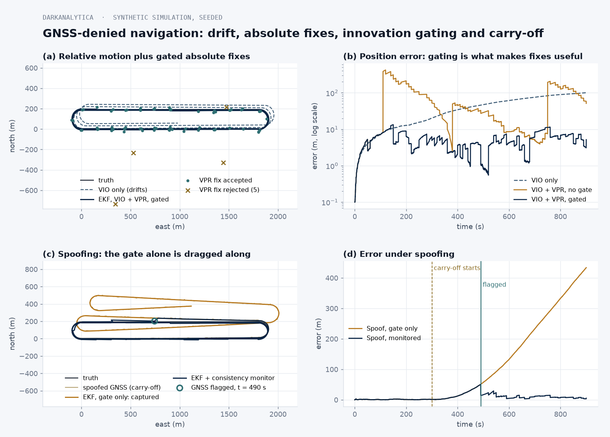

<p align="center"></p>

[](https://github.com/darkanalytica1/gnss-denied-navigation-primer/actions/workflows/tests.yml)


## What this is

A primer and a small, tested Python package on navigating when satellite navigation is denied or deceived. It explains jamming versus spoofing, why visual-inertial odometry drifts, how visual place recognition supplies absolute fixes that are sometimes confidently wrong, and how an extended Kalman filter with Mahalanobis innovation gating decides which fixes to believe. A seeded 2D simulation shows each mechanism, including the uncomfortable one: a slow spoofing carry-off that walks straight through an innovation gate, and two consistency monitors that catch it.

## Why it matters

A jammed receiver knows it is lost; a spoofed receiver is confident and wrong. For any platform that must keep operating in contested electromagnetic environments, the question is not whether GNSS can be protected absolutely, but whether it has stopped being the only witness. That comes down to architecture: a relative source that cannot be spoofed by radio but drifts, absolute sources that do not drift but can lie, and an estimator whose covariance is honest enough for its gate to mean something. The same vocabulary lets an evaluator ask precise questions of a navigation claim: accuracy as a distribution, under which conditions, with what rate of wrong fixes, and what the system does when its sources disagree.

<p align="center"></p>

*Figure 1. VIO drives the prediction; each absolute fix becomes an innovation; the chi-square gate accepts a fix with d² = 1.44 and rejects one with d² = 11.1 against the 99 % threshold of 9.21 for two dimensions.*

## Quick start

```bash
git clone https://github.com/darkanalytica1/gnss-denied-navigation-primer
cd gnss-denied-navigation-primer
python -m gnssdenied.demo                 # prints metrics; writes a PNG if matplotlib is installed, else CSV
python -m gnssdenied.demo --csv --seed 3  # other seeds, plus CSV time series
pip install -r requirements-dev.txt && python -m pytest
```

The package needs only the Python standard library. `matplotlib` is optional and used only for the figure.

```python
from gnssdenied import EKF, chi2_ppf, mahalanobis_d2, run, Config
from gnssdenied import linalg as la

mahalanobis_d2([30, 40], la.diag([15**2, 15**2]))   # 11.1 > chi2_ppf(0.99, 2) = 9.21, rejected

r = run("gated", Config(), seed=7)                   # VIO + VPR with gating
print(r.summary().row())
```

## What the simulation shows

Default configuration, seed 7, 900 s racetrack at 15 m/s. Errors are 2D position errors, in metres. Mean NEES near 2 means the filter's covariance describes its real error.

| Scenario | RMSE | CEP50 | CEP95 | Final | Mean NEES | Note |
|---|---:|---:|---:|---:|---:|---|
| VIO only | 54.2 | 40.9 | 95.1 | 100.7 | 0.6 | drifts without bound |
| VIO + VPR, no gate | 113.7 | 33.0 | 243.8 | 51.2 | 405 | wrong matches accepted: worse than no fixes |
| **VIO + VPR, gated** | **5.8** | **4.9** | **9.8** | **5.2** | **1.1** | 5 of 5 wrong matches rejected, 0 correct fixes rejected |
| Spoof, gate only | 174.2 | 31.0 | 389.4 | 433.6 | 62,190 | carry-off accepted, honest VPR fixes rejected |
| **Spoof, monitored** | **12.9** | **5.8** | **28.8** | **5.3** | 215 | GNSS flagged at t = 490 s, 190 s after onset |



*Figure 2. (a) Gated fusion follows the truth while VIO alone drifts; red crosses are rejected wrong matches. (b) Error over time on a log scale. (c) Under a slow carry-off the gate-only filter is dragged along with the spoofed track; the monitored filter flags GNSS and re-anchors on VPR. (d) Error under spoofing, with onset and detection marked.*

These numbers are synthetic. They come from illustrative sensor parameters chosen to make mechanisms visible, and they say nothing about the performance of any real system.

## Method

| Module | Contents |
|---|---|
| `gnssdenied.ekf` | `EKF` with `predict` and `update(..., gate_prob=0.99)`; Joseph-form covariance update; `mahalanobis_d2` |
| `gnssdenied.sim` | truth trajectory, VIO with bias random walk, VPR fixes with wrong matches, GNSS with a carry-off drag, navigation filter with state `[px, py, bx, by]`, `ConsistencyMonitor`, scenario runner |
| `gnssdenied.metrics` | `rmse`, empirical `cep`, `nees`, `nees_bounds`, `Summary` |
| `gnssdenied.stats` | `chi2_ppf`, `chi2_cdf`, circular-normal CEP factors, all without SciPy |
| `gnssdenied.linalg` | the few matrix operations a 4-state filter needs, in plain Python |
| `gnssdenied.demo` | the CLI: prints the tables above, writes PNG or CSV |

The documentation explains each concept with its formulas:

1. [Jamming versus spoofing](docs/01-jamming-vs-spoofing.md): signal power, the honest and the dangerous failure, detection layers.
2. [Drift: inertial and visual-inertial odometry](docs/02-drift-and-vio.md): why integration turns bias into unbounded error.
3. [Visual place recognition](docs/03-vpr-absolute-fixes.md): absolute fixes that can be confidently wrong.
4. [The EKF and Mahalanobis innovation gating](docs/04-ekf-and-gating.md): equations, worked example, failure modes.
5. [Spoofing carry-off and consistency monitoring](docs/05-spoofing-carry-off.md): why a gate alone is captured, and what catches it.
6. [Metrics: RMSE, CEP and NEES](docs/06-metrics.md): accuracy as a distribution, consistency as a test.

## Limitations and assumptions

- **Two dimensions, synthetic sensors.** No attitude, altitude, scale drift, camera geometry or terrain. Sensor noise is Gaussian with known parameters, which is the best case for any filter.
- **The effect, not the signal.** Spoofing is modelled as a displacement of the GNSS position solution. Nothing here describes how to generate, transmit or tune counterfeit signals.
- **Wrong VPR matches are independent.** Correlated wrong matches over a repetitive area are harder, and can capture a filter.
- **Monitors have limits.** A drag slower than the plausible VIO bias is invisible to the displacement test, and the witness test needs a working VPR. Detection takes minutes at these settings. A spoofer that also degrades vision defeats both.
- **Thresholds are illustrative.** Gate probability, bias bounds and vote counts are chosen for clarity, not tuned or validated for any operational system.
- **Consistency statistics along one trajectory are correlated.** NEES bounds are indicative for a single run; use independent Monte Carlo runs for a proper test.

## Sources

IS-GPS-200; Groves (2013); Kaplan and Hegarty (2017); Bar-Shalom, Li and Kirubarajan (2001); Brown and Hwang (2012); Psiaki and Humphreys (2016); Forster et al. (2017); Lowry et al. (2016). Full references and confidence notes: [docs/SOURCES.md](docs/SOURCES.md).

## License

MIT. See [LICENSE](LICENSE).

<sub>DarkAnalytica · public sources and original synthesis · educational use</sub>
